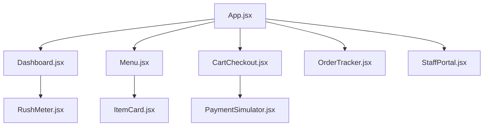

# Implementation Plan: Smart Canteen Management App

A responsive, high-fidelity web application tailored to Indian college canteens. It addresses peak rush times, menu complexity, payment failures, and online order scheduling, wrapped in an ultra-premium, white-themed "Liquid Glass" (iOS 27 glassmorphic) UI.

---

## User Review Required

We are designing this application to be highly interactive, showing both the **Student's Portal** and a **Canteen Staff Dashboard** in a split-screen or toggled view. This allows faculty and judges to see the real-time interaction (e.g., student places order -> canteen bhaiya receives it and updates status -> student gets instant notification).

> [!IMPORTANT]
> **Key Architecture Decisions:**
> 1. **Framework:** We propose **React + Vite** with **Vanilla CSS** (using CSS variables, flexbox/grid, backdrop-filter blur, and smooth animations) to achieve the liquid glass effect. This can be built as a single-page application and deployed instantly to Vercel, Netlify, or GitHub Pages.
> 2. **State Management:** Local storage and React state will simulate a real-time backend. Opening two tabs or splitting the view will let you demo the student and staff flows simultaneously.

---

## Open Questions

These are the design and feature questions we would love your input on:

1. **User Portals:** Would you like the default view to be a split-screen (Student on the left, Canteen Bhaiya on the right) so it's easy to demonstrate in a single presentation, or a toggle-based view?
2. **Hostel Delivery / Table Ordering:** Should we include a QR-code table ordering feature (where students scan a QR code on a canteen table to order directly to that table) or stick to self-pickup counters?
3. **Wallet System:** Do you agree with the pre-loaded "Canteen Wallet" concept to bypass UPI network failures at peak times, or should we focus solely on a UPI gateway simulator?

---

## Proposed Changes

We will create a new directory `canteen-app` under the user scratch directory and build the React-Vite project.

### Component Structure

#### [NEW] [canteen-app/src/App.jsx](file:///C:/Users/Raja/.gemini/antigravity/scratch/canteen-app/src/App.jsx)
Main container that handles routing (or tab switching) between Student Portal, Order Tracker, and Canteen Staff Simulator.

#### [NEW] [canteen-app/src/index.css](file:///C:/Users/Raja/.gemini/antigravity/scratch/canteen-app/src/index.css)
The core design system.
- Colors: Liquid glass theme (translucent whites, subtle gradients, soft shadows, vibrant glass highlights).
- Typography: System fonts combined with Google Fonts (Geist/Inter).
- CSS Backdrop blur and glassmorphic variables.

#### [NEW] [canteen-app/src/components/Dashboard.jsx](file:///C:/Users/Raja/.gemini/antigravity/scratch/canteen-app/src/components/Dashboard.jsx)
Student homepage:
- **Live Rush Indicator**: Dynamic meter showing current crowd level (Low, Moderate, Peak) based on active orders, and estimated wait time.
- **Canteen Wallet Card**: Shows balance, quick top-up buttons.
- **Today's Specials**: Carousel of popular in-stock items.

#### [NEW] [canteen-app/src/components/Menu.jsx](file:///C:/Users/Raja/.gemini/antigravity/scratch/canteen-app/src/components/Menu.jsx)
Categorized list of dishes (Breakfast, Lunch, Snacks, Dinner, Drinks) with search, Veg/Non-Veg filter, spice indicator, and real-time stock counts.

#### [NEW] [canteen-app/src/components/CartCheckout.jsx](file:///C:/Users/Raja/.gemini/antigravity/scratch/canteen-app/src/components/CartCheckout.jsx)
Slide-up cart panel:
- Order scheduling toggle (Order Now vs Pick a slot during breaks).
- Integration of a mock Payment Gateway (UPI QR scan, in-app wallet, card simulation).

#### [NEW] [canteen-app/src/components/OrderTracker.jsx](file:///C:/Users/Raja/.gemini/antigravity/scratch/canteen-app/src/components/OrderTracker.jsx)
Visual tracking page showing:
- Active order state (Received, Preparing, Ready, Collected).
- Secure QR pickup token (can be shown to staff for scanning).
- "Check-in" button (trigger to start cooking for scheduled orders).

#### [NEW] [canteen-app/src/components/StaffPortal.jsx](file:///C:/Users/Raja/.gemini/antigravity/scratch/canteen-app/src/components/StaffPortal.jsx)
The Canteen Staff dashboard:
- Incoming orders queue.
- One-tap status updates (Accept -> Mark Ready -> Mark Collected).
- Paytm-style sound alerts ("New order received for token 45!").
- Menu stock toggle (instantly mark items as out of stock, which syncs with the student menu).

---

## Verification Plan

### Automated Tests
- Build verification using Vite (`npm run build`).
- Linting checks.

### Manual Verification
- Testing the ordering flow: placing an order as a student, checking the rush meter increase, checking the staff dashboard for the new order.
- Simulating UPI payment success/failure.
- Verifying the responsive layout on multiple simulated viewport widths (mobile, tablet, desktop).
- Verifying the smoothness of glassmorphic animations and hover effects.
